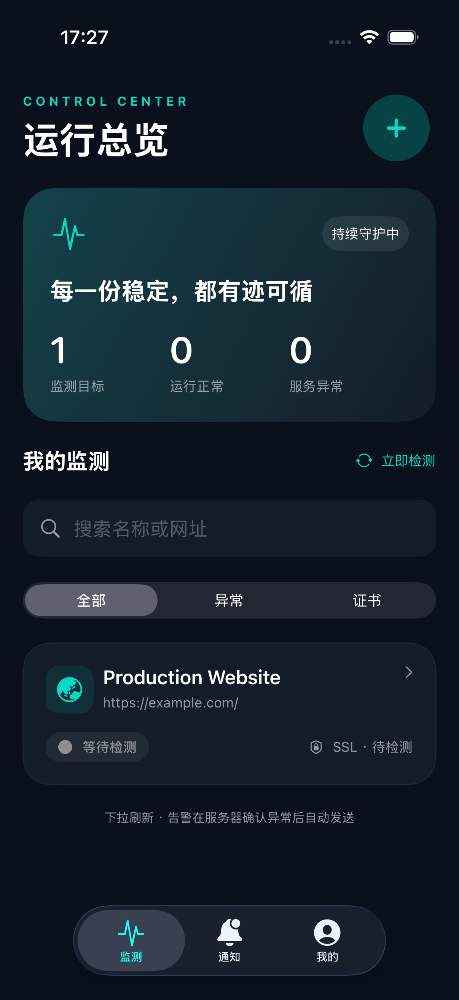

# BudMon iOS 与多用户部署

## 本地启动

需要 Python 3.12、Node.js 20+，iOS 开发需要 Xcode（最低部署 iOS 17）。

```bash
python3.12 -m venv .venv
.venv/bin/pip install -r backend/requirements.txt
BUDMON_DATA_DIR="$PWD/.local-data" .venv/bin/uvicorn backend.app.main:app --host 127.0.0.1 --port 8000
```

网页开发另开终端：

```bash
cd frontend
npm ci
npm run dev
```

Vite 开发服务器已代理 `/api` 到 `127.0.0.1:8000`。先访问网页完成管理员初始化；普通用户之后可以在网页或 iOS 注册。账号为 3–32 位字母、数字、`_ . -`，新密码至少 8 位且最多 72 个 UTF-8 字节。已有旧密码仍可登录。

也可以直接从当前代码构建 Docker：

```bash
cp .env.example .env
docker compose -f docker-compose.local.yml up -d --build
```

网页与 API 都位于 `http://localhost:9977`。iOS 支持公网 HTTP 和 HTTPS，填写服务器根地址，例如 `http://服务器公网IP:9977` 或 `https://monitor.example.com`，不附加 `/api`。默认 Compose 的镜像模式用于已发布镜像，验证本次代码请使用 `docker-compose.local.yml`。

## 打开和运行 iOS

1. 直接打开 `ios/BudMon.xcodeproj`，无需下载 Swift 第三方依赖。
2. Scheme 选择 **BudMon**，选择 iPhone 模拟器运行。首次登录页填写 `http://localhost:8000`（本机后端）或 `http://localhost:9977`（Docker）。
3. 真机运行时，将 App Bundle ID 修改为自己的唯一标识，并在 Signing & Capabilities 选择 Apple Developer Team、启用 Push Notifications。真机不能用 `localhost` 访问 Mac；可使用公网 HTTP/HTTPS 地址，或可解析的 `http://你的Mac名称.local:8000`，此时后端需绑定 `0.0.0.0`。
4. 若修改工程结构，可执行 `xcodegen generate --spec ios/project.yml`。提交的 `.xcodeproj` 可直接用；重新生成前需同步自定义 Bundle ID / Team 到 YAML，避免覆盖。

界面包含注册登录、运行总览、名称/网址搜索、异常/证书筛选、新增/编辑/暂停/删除目标、状态与证书详情、分页历史、告警收件箱、推送开关、额度展示、修改密码、退出与删除账号。采用深色原生 SwiftUI 布局，支持 iPhone/iPad、下拉刷新；总览前台每 30 秒刷新。时间线显示北京时间，证书到期字段保留 ISO 时区。

凭据存入 `AfterFirstUnlockThisDeviceOnly` Keychain。访问令牌有效期 24 小时，刷新凭据有效期 30 天，每次刷新轮换，改密会撤销所有登录和设备绑定。退出必须联网以解绑本机 APNs token，避免下一位设备使用者收到旧账号的通知。

客户端通过 `NSAllowsArbitraryLoads` 支持用户自定义的公网 HTTP 地址，并移除了会覆盖该设置的 `NSAllowsLocalNetworking` 键，见 [Apple ATS 配置说明](https://developer.apple.com/documentation/bundleresources/information-property-list/nsapptransportsecurity/nsallowsarbitraryloads)。修改后需重新编译安装 iOS App。

## APNs 真机通知

服务端实现 Apple HTTP/2 Provider API，使用 ES256 签名的 Provider Token；遵循 [Apple 的发送通知文档](https://developer.apple.com/documentation/usernotifications/sending-notification-requests-to-apns)。

1. 在 Apple Developer 创建有 APNs 权限的 `.p8` key，记录 Key ID 与 Team ID；App Identifier 开启 Push Notifications。
2. 将密钥保存为 `secrets/apns/AuthKey.p8`，此目录已被 Git 忽略。不要将私钥放进 iOS App 或前端。
3. 在 `.env` 填写 `APNS_KEY_ID`、`APNS_TEAM_ID`、`APNS_BUNDLE_ID`（与 App 完全一致）以及 `APNS_KEY_PATH=/run/secrets/apns/AuthKey.p8`。
4. 启动带密钥挂载的服务：

```bash
docker compose -f docker-compose.local.yml -f compose.apns.yml up -d --build
```

5. 用开发签名运行 Debug 真机 App，在「我的 → 开启系统通知」授权。Debug 设备注册到 sandbox，Release/TestFlight 注册到 production；不要用 Release 配置配开发签名测试。通知页会明确显示设备注册状态和服务端是否配置 APNs。
6. 创建可控制的公网 HTTPS 测试目标，将其服务停止，等待两个连续失败的检测周期；或使用临近到期证书测试提醒。锁屏确认通知，再点击通知验证目标详情跳转。

网页/证书检测发生在服务器，App 不需常驻。默认每 60 秒一轮，每轮失败重试一次，连续两轮失败才告警；恢复发一条恢复通知。证书剩余天数低于后台阈值或验证失败会告警，每目标每天最多一条证书通知。HTTP 4xx/5xx 均判为异常（旧版本将 4xx 判为正常，本次纠正）。HTTP 目标不生成 SSL 检查记录。

告警立即写入收件箱和持久化设备发件队列，独立任务每 5 秒投递，APNs 优先级 10。每台设备独立指数退避，最多 10 次，失效 token 删除，超过一天未投递的消息过期。APNs 接受不代表终端一定展示，系统通知权限、专注模式、网络和 Apple 服务均影响到达时间。无密钥时仍有真实站内告警，不会声称已发送远程推送。生产请检查 `push_deliveries.status/last_error` 与服务器日志。

## 多用户与旧库升级

升级前备份 SQLite 数据卷（运行中用 SQLite backup API，或停止服务后复制数据库与 WAL）。启动时自动增加表与字段：旧账号中最早的一个成为管理员，旧目标归属该管理员，检测历史保留。旧版本 token 不再有效，升级后需重新登录。新用户默认普通用户、5 个目标。

所有目标、历史、仪表盘、通知、设备、立即检测、清空记录均按账号隔离。系统监测策略和短信/邮箱渠道只有管理员可访问；旧全局短信/邮件收件人只接收管理员自己目标的通知，普通用户使用 APNs 与站内通知，避免跨用户泄露。

监测连接会校验全部 DNS 结果并连接固定公网 IP，每次重定向重新验证；禁止回环、私网、元数据地址及保留网段。监测并发上限 8。现阶段部署为 **单后端进程、单实例**（不要添加多个 Uvicorn workers 或横向副本，调度与推送互斥为进程内锁）。SQLite 使用 WAL、30 秒 busy timeout。Compose 后端不映射公网端口，只信任同一私有 Docker 网络的前端代理；如自行暴露后端，必须将 `FORWARDED_ALLOW_IPS` 收紧为可信代理 IP，避免伪造来源绕过限流。大量目标部署应进一步拆分任务队列和 PostgreSQL。

## 会员与收费扩展

管理员网页「用户与配额」可查看用户、停用账号、指定免费/专业套餐、自定义数量、设置带时区的到期时间；变更写入 `audit_logs`。用户无法自行修改权益。

- `plans`：套餐代码、数量、最小货币单位价格、币种、Apple 产品 ID、启用状态。
- `users`：套餐、到期时间、人工配额覆盖；新增目标在 `BEGIN IMMEDIATE` 事务内计数与创建，防止并发绕过上限。所有目标（含暂停）占额度。
- 到期时有效套餐回落免费版；保留已有目标继续检测，超额用户不能新增，删除后额度立即释放。`quota_override` 为管理员独立授权，优先于套餐且不会随套餐到期失效；如需撤销，清空覆盖值。
- `billing_events`：预留支付事件表，`(provider, external_id)` 唯一，供后续已验签支付事件幂等入账。
- `/api/plans` 明确返回 `purchase_enabled: false`。当前不展示可点击的购买按钮，不收款，不伪造订阅成功。

正式接入付费时增加 StoreKit 2 产品查询/购买/恢复购买、服务端 App Store 签名交易校验、Server Notifications V2 幂等处理、续订/退款/撤销同步与权益流水。支付验签通过后才更新套餐；切勿信任客户端传来的数量或购买成功标志。可复用现有套餐、配额和审计基础。

## 验证

```bash
.venv/bin/pip install pytest
.venv/bin/python -m pytest backend/tests -q
cd frontend && npm run build
```

Xcode 的 BudMon scheme 含独立单元测试；`BudMonUI` scheme 为实际端到端测试，要求 `localhost:8000` 已运行且完成初始化。UI 测试会注册随机测试账号、创建目标，并保存五个页面的截图到 `.xcresult`；仅在开发数据库运行，可使用这些测试账号的自助删除功能清理数据，或直接使用临时数据库运行测试。

```bash
xcodebuild -project ios/BudMon.xcodeproj -scheme BudMon \
  -sdk iphonesimulator -configuration Debug CODE_SIGNING_ALLOWED=NO build
xcodebuild -project ios/BudMon.xcodeproj -scheme BudMon \
  -destination 'platform=iOS Simulator,name=iPhone 17 Pro' CODE_SIGN_IDENTITY=- test
xcodebuild -project ios/BudMon.xcodeproj -scheme BudMonUI \
  -destination 'platform=iOS Simulator,name=iPhone 17 Pro' CODE_SIGN_IDENTITY=- test
```

真实 APNs 投递需要开发者账号、签名真机和密钥；单元测试通过 HTTP mock 验证 Apple 错误处理与重试，不等同于真机送达验证。

## 模拟器实测截图

截图来自真实本地 API 注册和创建目标后的 iPhone 17 Pro 模拟器，首次检测前的等待状态是实际数据。



其他页面：[登录](screenshots/01-sign-in.png)、[详情](screenshots/03-detail.png)、[通知](screenshots/04-notifications.png)、[账户](screenshots/05-account.png)。

## APNs 配置提示排查

若密钥已存在，但 App 仍提示未配置，先在服务器执行以下检查（不输出私钥）：

```bash
docker exec budmon-backend python -c 'from app.push import configured; print("APNs configured:", configured())'
```

`True` 表示当前容器的四项环境变量与密钥文件存在性检查通过，并不代表已通过 Apple 鉴权或通知已送达。此时核对 App 的服务器地址，以及客户端是否已更新配置状态。iOS 已修复设备注册时读取旧 profile、将未加载配置当作未配置的问题：注册完成重新请求 `/api/me`，刷新账户时同步更新状态，并提供「刷新推送状态」按钮。此修复需要重新编译安装 App。

## 检测历史分页与保留策略

详情页每页加载 20 条记录，滚动至末尾按需加载，也可点击「加载更早记录」。切换「全部记录 / 仅异常」会重新分页；异常由服务端筛选，包括服务失败、证书检查失败和达到当前证书到期告警阈值的记录。取消页面请求不再弹出 cancelled 错误，其他加载错误在时间线内显示并提供重试。

后台默认每个目标最多保留 **7 天、1,000 条**记录，先达到的限制生效。监测完成后清理该目标，服务启动及每 5 分钟清理所有目标（包含暂停目标）。配置示例：

```yaml
environment:
  BUDMON_LOG_RETENTION_DAYS: "7"
  BUDMON_LOG_MAX_PER_TARGET: "1000"
```

超期、超量的正常与异常检测记录都会清理；目标配置和独立的告警收件箱不受此项清理影响。SQLite 删除后空间可被后续写入复用，数据库文件不一定立即缩小。本次功能需重新发布部署后台镜像并重新编译安装 iOS，现有线上 1.0.2 镜像不会因源码修改自动更新。
